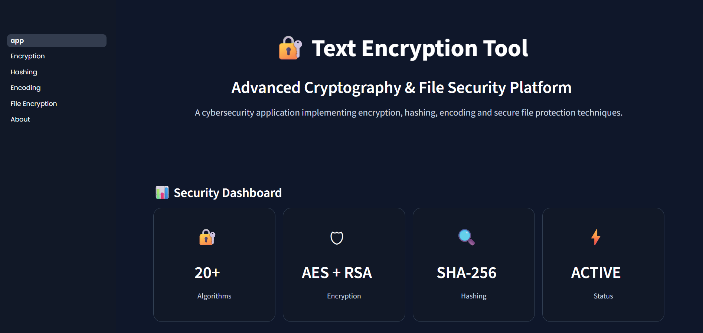
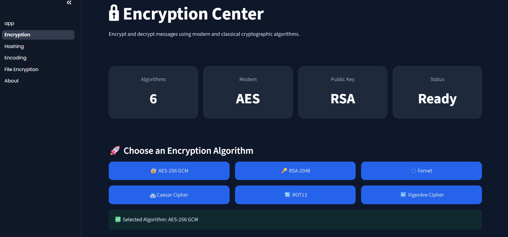
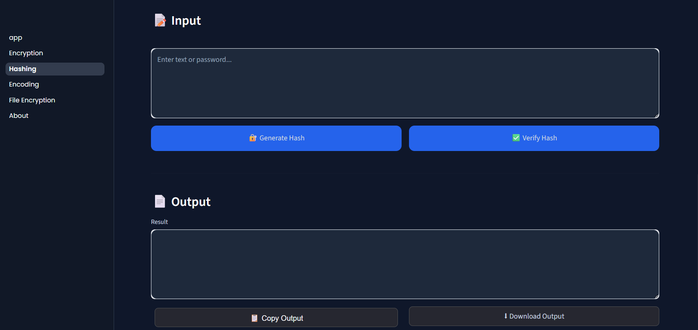
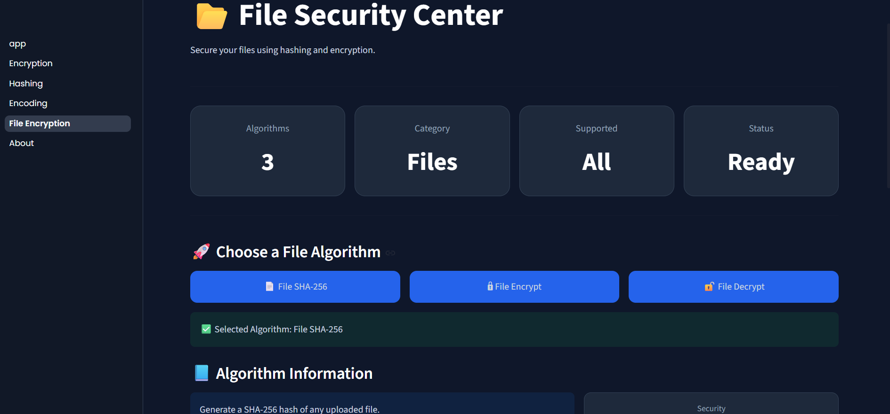

# 🔐 Text Encryption Tool
[](https://github.com/bhoomikagowda518-ops/Text-Encryption-Tool)
---

## 🚀 Live Demo

Try the application here:

[Click here for Live Demo](https://text-encryption-tool-rypytn7rwz5wga9vrnwpuh.streamlit.app/)

**A Python and Streamlit-based cybersecurity application implementing classical ciphers, modern symmetric/asymmetric encryption, secure hashing, encoding, and file protection through an interactive security dashboard — built to understand how real-world security systems handle confidentiality, integrity, and secure data processing.**




---

## Table of Contents

- [Overview](#overview)
- [Objectives](#objectives)
- [Features](#features)
- [Technologies Used](#technologies-used)
- [Project Architecture](#project-architecture)
- [Installation](#installation)
- [Usage](#usage)
- [Example Workflow](#example-workflow)
- [Testing](#testing)
- [Security Implementation Details](#security-implementation-details)
- [Limitations](#limitations)
- [Future Improvements](#future-improvements)
- [Learning Outcomes](#learning-outcomes)
- [Author](#author)

---

## Overview

**Text Encryption Tool** is a cybersecurity-focused application built using Python and Streamlit to explore how encryption, encoding, hashing, and file security work through both practical implementation and an interactive user interface..

The project was created to bridge the gap between studying cryptographic concepts in a classroom setting and actually implementing them in working code. It covers the full spectrum of a typical introductory cybersecurity curriculum: classical ciphers that illustrate historical cryptographic weaknesses, modern symmetric encryption standards used in production systems (AES, Fernet), asymmetric encryption for secure key exchange (RSA), and one-way hashing for data integrity and password storage (SHA-256, bcrypt).

Rather than treating each technique as an isolated script, the tool is organized into a modular architecture with a Streamlit-based graphical interface, structured logging, exception handling, secure key storage, and an automated test suite, reflecting practices used in real software projects, not just standalone academic exercises.

**Concepts demonstrated:**
- Confidentiality through symmetric and asymmetric encryption
- Historical cryptanalysis weaknesses (Caesar, ROT13, Vigenère)
- Authenticated encryption using AES-GCM
- Public-key cryptography and secure key exchange using RSA
- One-way hashing and password security using bcrypt
- Secure randomness (nonce generation) in encryption schemes
- Software engineering practices applied to a security context

---

## Objectives

This project was built with the following learning goals in mind:

- Understand the mathematical and practical differences between classical and modern cryptography
- Learn how symmetric encryption (AES, Fernet) and asymmetric encryption (RSA) differ in use case and implementation
- Understand why hashing is used for integrity verification and password storage, and why it is not the same as encryption
- Learn secure key management practices, including key generation, storage, and PEM encoding
- Understand the role of nonces/IVs in preventing repeated-key vulnerabilities in AES-GCM
- Apply software engineering fundamentals — modular design, logging, exception handling, and unit testing — to a security-focused codebase
- Build a portfolio-ready project demonstrating applied cybersecurity skills for internship and fresher-level roles

---

## Features

### 1. Classical Cryptography
- **Caesar Cipher** — encryption and decryption using shift-based substitution
- **ROT13** — fixed-rotation text transformation
- **Vigenère Cipher** — polyalphabetic encryption and decryption using a keyword

### 2. Encoding Techniques
- **Base64** — encoding and decoding
- **Hexadecimal** — text-to-hex conversion and decoding

> Note: Encoding is not encryption. These are included to demonstrate the distinction between reversible data representation and actual cryptographic protection.

### 3. Hashing Algorithms
- **SHA-256** — text hashing and file integrity hashing
- **Bcrypt** — salted password hashing and verification

### 4. Symmetric Encryption
- **Fernet (AES-128-CBC + HMAC)** — authenticated message encryption with built-in key management
- **AES-256-GCM** — message and file encryption/decryption with random nonce generation per operation

### 5. Asymmetric Encryption
- **RSA (2048-bit)** — key pair generation, OAEP padding with SHA-256, public-key encryption, and private-key decryption with PEM-based key storage

### Core Application Features
### Streamlit User Interface

- Interactive cybersecurity dashboard
- Algorithm selection interface
- Encryption and decryption controls
- Hash generation and verification interface
- Encoding tools through graphical controls
- File upload and download support
- Cybersecurity-themed custom UI design
- Real-time operation feedback
- Menu-driven command-line interface
- Modular folder structure separating algorithms, keys, tests, and files
- Centralized logging system
- Exception handling across all cryptographic operations
- Automated unit test suite covering every module
- Secure local key storage (excluded from version control)

---

## Technologies Used

| Category         | Tool / Library                                |
| ---------------- | --------------------------------------------- |
| Language         | Python 3                                      |
| Framework        | Streamlit                                     |
| Cryptography     | `cryptography` library (Fernet, AES-GCM, RSA) |
| Password Hashing | `bcrypt`                                      |
| UI Styling       | HTML/CSS customization                        |
| Testing          | `unittest`                                    |
| File Handling    | Python `os`, `io`                             |
| Logging          | Python `logging` module                       |

---

## Application Screenshots

### Home Dashboard


### Encryption Center




### Hashing Center




### File Security Center



## Project Architecture

```
Text-Encryption-Tool/

│
├── app.py
│
├── algorithms/
│   ├── aes_encrypt.py
│   ├── aes_decrypt.py
│   ├── rsa_encrypt.py
│   ├── rsa_decrypt.py
│   ├── fernet_encrypt.py
│   ├── fernet_decrypt.py
│   ├── caesar_encrypt.py
│   ├── vigenere_encrypt.py
│   ├── sha256.py
│   ├── bcrypt_hash.py
│   └── file_security_modules
│
├── pages/
│   ├── 1_Encryption.py
│   ├── 2_Hashing.py
│   ├── 3_Encoding.py
│   ├── 4_File_Encryption.py
│   └── 5_About.py
│
├── assets/
│   └── style.css
│
├── keys/
│   └── Encryption key files
│
├── tests/
│
├── logger.py
│
├── requirements.txt
│
└── README.md


## Installation

Clone the repository and install dependencies:

```bash
git clone https://github.com/<your-username>/Text-Encryption-Tool.git
cd Text-Encryption-Tool
pip install -r requirements.txt
```

**Requirements:**
- Python 3.x (Tested with Python 3.13)
- `cryptography`
- `bcrypt`

---

## Usage

Run the Streamlit application from the project root:

```bash
streamlit run app.py

You will be presented with a menu to select the desired cryptographic operation:

```
==== Text Encryption Tool ====
1. Caesar Encrypt
2. Caesar Decrypt
3. ROT13
4. Vigenère Encrypt
5. Vigenère Decrypt
6. Base64 Encode
7. Base64 Decode
8. Hex Encode
9. Hex Decode
10. SHA256 Hash
11. Bcrypt Hash
12. Bcrypt Verify
13. File SHA256 Hash
14. Fernet Encrypt
15. Fernet Decrypt
16. File Encrypt
17. File Decrypt
18. AES Encrypt
19. AES Decrypt
20. AES File Encrypt
21. AES File Decrypt
22. RSA Encrypt
23. RSA Decrypt
24. Exit
```

Each option prompts for the required input (plaintext, key, or file path) and displays the result, with all operations logged for traceability.

---

## Example Workflow

**Scenario: Encrypting a file using AES-256-GCM**

1. Select the AES file encryption option from the menu
2. Provide the path to the target file
3. The tool generates a random 256-bit key and a unique nonce
4. The file is encrypted using AES-GCM, which internally generates an authentication tag to verify data integrity during decryption.
5. The key is stored securely in the `keys/` directory
6. Decryption reverses the process, verifying the authentication tag before returning plaintext

This mirrors how authenticated encryption is used in real systems to guarantee both **confidentiality** and **integrity** — if the ciphertext or key is tampered with, decryption fails rather than returning corrupted data silently.

---

## Testing

The project includes a full **unittest** suite validating the correctness of every cryptographic module.

**Test files:**

| Test File | Coverage |
|---|---|
| `test_caesar.py` | Caesar cipher encryption/decryption |
| `test_vigenere.py` | Vigenère cipher encryption/decryption |
| `test_encoding.py` | Base64 and hex encoding/decoding |
| `test_hashing.py` | SHA-256 hashing and bcrypt password hashing/verification |
| `test_fernet.py` | Fernet encryption/decryption |
| `test_file_crypto.py` | File-level encryption/decryption |
| `test_aes.py` | AES-256-GCM message encryption/decryption |
| `test_aes_file.py` | AES-256-GCM file encryption/decryption |
| `test_rsa.py` | RSA key generation, encryption, and decryption |

**Run all tests:**

```bash
python -m unittest discover tests
```

All modules pass their respective test cases, covering both correct-input behavior and expected failure handling (e.g., decryption with a wrong key or tampered ciphertext).

---

## Security Implementation Details

**AES-256-GCM**
AES is used in Galois/Counter Mode (GCM), an authenticated encryption mode that provides both confidentiality and integrity in a single pass. A unique random nonce is generated for every encryption operation — reusing a nonce with the same key in GCM mode is a critical vulnerability, so this is explicitly handled per operation rather than reused or hardcoded.

**RSA (2048-bit)**
RSA is used for asymmetric encryption with OAEP (Optimal Asymmetric Encryption Padding) using SHA-256, which prevents the padding-oracle style weaknesses associated with older PKCS#1 v1.5 padding. Keys are generated as a public/private pair and stored in PEM format, with the private key kept isolated from the public key.

**Bcrypt**
Passwords are never stored or compared in plaintext. Bcrypt applies a computationally expensive, salted hashing algorithm designed specifically to resist brute-force and rainbow-table attacks, unlike general-purpose hash functions.

**SHA-256**
Used for data integrity verification — both for arbitrary text and for whole files — allowing detection of any modification to the original content.

**Key Management**
Symmetric keys (AES, Fernet) and RSA key pairs are generated programmatically and stored locally in a dedicated `keys/` directory, which is excluded from version control using .gitignore to prevent accidental exposure of sensitive keys.

**Nonce Usage**
A nonce (number used once) is generated fresh for every AES-GCM operation to ensure that encrypting the same plaintext twice with the same key never produces identical ciphertext, preventing pattern analysis attacks.

---

## Limitations

This project is built for **educational purposes** to demonstrate applied understanding of cryptographic concepts. It is **not intended for production use** and does not replace vetted, audited cryptographic libraries or systems. Specifically:

- Key storage is local and file-based, not backed by a hardware security module (HSM) or secrets manager
- No key rotation, revocation, or expiry mechanism is implemented
- The CLI interface is not designed for concurrent or multi-user access
- No formal security audit or penetration testing has been performed on this codebase

---

## Future Improvements

- Cloud deployment using Streamlit Community Cloud or similar platforms
- User authentication and role-based access
- Password-based key derivation using PBKDF2 / Argon2
- Digital signatures using RSA/ECDSA
- Secure file-sharing workflow combining RSA key exchange with AES encryption
- Additional algorithms such as ChaCha20-Poly1305 and ECC
---

## Learning Outcomes

Building this project reinforced practical understanding of:

- The distinction between encoding, hashing, and encryption — and when each is appropriate
- Why authenticated encryption modes (like AES-GCM) are preferred over unauthenticated modes
- How asymmetric cryptography enables secure key exchange without a shared secret
- Why password hashing algorithms are deliberately slow, unlike general-purpose hash functions
- The importance of unit testing in validating security-critical code
- Structuring a Python project with maintainability and modularity in mind

---

## 👩‍💻 Author

**Bhoomika B C**

🎓 Computer Science Engineering Student  
🔐 Cybersecurity Enthusiast  

🔗 **Connect with me**

- 🐙 GitHub: [bhoomikagowda518-ops](https://github.com/bhoomikagowda518-ops)
- 💼 LinkedIn: [Bhoomika B C](https://www.linkedin.com/in/bhoomikabc2008)

*This project is part of an ongoing effort to build practical, demonstrable cybersecurity skills through hands-on implementation rather than theory alone.*
